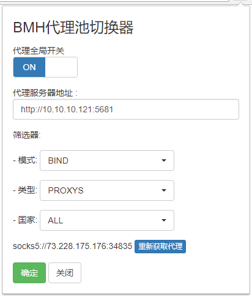

# BMH proxy chrome
连接baimaohui代理池项目的Chrome插件。

后端的代理词项目是一个相当庞大的系统，本插件脱离后端的 **代理池系统** 无法使用。

## 后端系统
- 支持TOR连接池
- 支持SSH连接池
- 支持全球范围的PROXY代理池自动获取
- 支持随机动态IP
- 支持各种过滤条件：类型，国家，是否匿名……
- 支持数据加密，绕过过滤规则
- 可支持大规模的爬虫需求

## 截图效果
